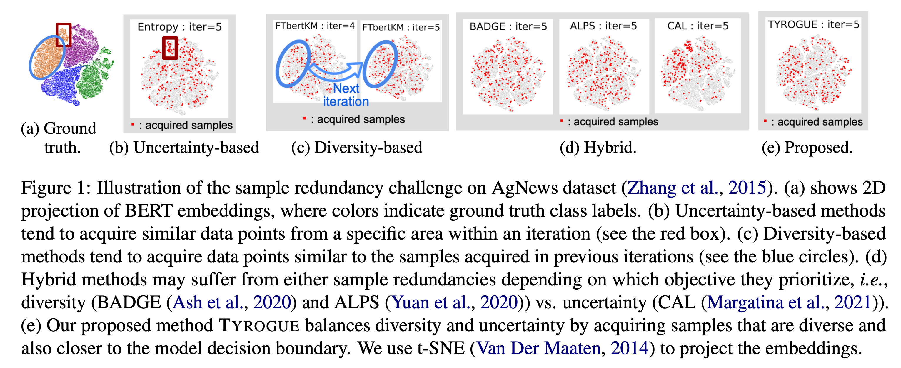

# Low-budget Active Learning
<!-- This work is mainly done during Seiji's winter internship. -->

In this work ("Low-resource Interactive Active Labeling for Fine-tuning Language Models" presented at [EMNLP Findings 2022](https://aclanthology.org/2022.findings-emnlp.235)), we propose a novel yet simple acquisition function for low-budget active learning.
A major characteristic of our function is to overcome sample redundancy problems that existing methods suffer from.
This repository covers ours and other baselines including the state-of-the-art methods.

[](https://github.com/rit-git/AL_22S/blob/main/tyrogue.png) 

## Acquisition functions
Our codebase supports existing acquisition functions.
+ Uncertainty-based methods: `Entropy`
+ Diversity-based methods: `FTbertKM`
+ Hibrid: `Tyrogue`, `CAL`, `ALPS`, `BADGE`
+ Random sampling: `random`

## Datasets
+ Sentiment analysis: `SST-2`, `IMDB`
+ Topic classification: `AGNEWS`, `PUBMED`, `DBPEDIA`
+ Paraphrase detection: `QQP`
<!-- + Natural language inference -->

## Models
Our codes adopt `BERT-BASE`, but users can use any other models from [HuggingFace](https://github.com/huggingface/transformers).

## Installation
Please install the required torch packages:
```
conda install pytorch==1.10.2 torchvision torchaudio cudatoolkit=11.3 -c pytorch -c nvidia
```
Then, install other requirements:

`pip install -r requirements.txt`

### External library
Our code does not includes existing acquisition functions, `CAL`, `ALPS`, `BADGE`, `Entropy`, `FTbertKM`, and  `random`. So, please copy a folder `acquisition/` from [CAL](https://github.com/mourga/contrastive-active-learning) and then paste it to the root of this repository. 

## Usage
### Tyrogue
The main script is `main/run_fixed.py`.

```
python run_fixed.py\
  --dataset_name sst-2\
  --acquisition tyrogue\
  --r 3\
  --Srand 10000\
  --acquisition_size 50\
  --init_train_data 50\
  --budget 1050
```

By changing `--acquisition`, other acquisition functions can be used.

### Analysis
Before analyzing your results, please run the following script.

```
cd analysis/
python full_model_train.py \
  --dataset_name sst-2
```

Then, you can see the results on the notebook `analysis/result_analysis_gain_time.ipynb`.

For two-D plots, please run the follwing script.
```
python _embed_twoDim.py \
  --dataset_name sst-2
```

Then, you can see the two-D plot on the notebook `analysis/twoDim.ipynb`.

## Acknowledgements

We really thank the researchers and developers providing their open codebases. This repository contains codes from [HuggingFace](https://github.com/huggingface/transformers), [CAL](https://github.com/mourga/contrastive-active-learning).

## Disclosure
Embedded in, or bundled with, this product are open source software (OSS) components, datasets and other third party components identified below. The license terms respectively governing the datasets and third-party components continue to govern those portions, and you agree to those license terms, which, when applicable, specifically limit any distribution. You may receive a copy of, distribute and/or modify any open source code for the OSS component under the terms of their respective licenses. In the event of conflicts between Megagon Labs, Inc. Recruit Co., Ltd., license conditions and the Open Source Software license conditions, the Open Source Software conditions shall prevail with respect to the Open Source Software portions of the software. You agree not to, and are not permitted to, distribute actual datasets used with the OSS components listed below. You agree and are limited to distribute only links to datasets from known sources by listing them in the datasets overview table below. You are permitted to distribute derived datasets of data sets from known sources by including links to original dataset source in the datasets overview table below. You agree that any right to modify datasets originating from parties other than Megagon Labs, Inc. are governed by the respective third party’s license conditions. All OSS components and datasets are distributed WITHOUT ANY WARRANTY, without even implied warranty such as for MERCHANTABILITY or FITNESS FOR A PARTICULAR PURPOSE, and without any liability to or claim against any Megagon Labs, Inc. entity other than as explicitly documented in this README document. You agree to cease using any part of the provided materials if you do not agree with the terms or the lack of any warranty herein. While Megagon Labs, Inc., makes commercially reasonable efforts to ensure that citations in this document are complete and accurate, errors may occur. If you see any error or omission, please help us improve this document by sending information to contact_oss@megagon.ai.

All dataset and code used within the product are listed below (including their copyright holders and the license conditions). For Datasets having different portions released under different licenses, please refer to the included source link specified for each of the respective datasets for identifications of dataset files released under the identified licenses.

| ID  | OSS Component Name | Modified | Copyright Holder | Upstream Link | License  |
|-----|----------------------------------|----------|------------------|-----------------------------------------------------------------------------------------------------------|--------------------|
| 1 | BERT model | Yes  | Hugging Face | [link](https://huggingface.co/transformers/v3.0.2/_modules/transformers/modeling_bert.html) | Apache License 2.0 |

| ID  | Dataset | Modified | Copyright Holder | Source Link  | License |
|-----|---------------------|----------|------------------------|----------------------------------------------------------|---------|
| 1 | IMDB | No  |  | [source](http://ai.stanford.edu/~amaas/data/sentiment/) generated from [IMDb](https://www.imdb.com/) | |
| 2 | SST-2 | No  |  | [source](https://nlp.stanford.edu/sentiment/)  generated from [IMDb](https://www.imdb.com/)| |
| 3 | AgNews | No  |  | [source](http://groups.di.unipi.it/~gulli/AG_corpus_of_news_articles.html)  generated from [ComeToMyHead](http://newsengine.di.unipi.it/)| |
| 4 | DBPEDIA | No  |  | [source](https://github.com/dbpedia/extraction-framework)  generated from [DBpedia](https://www.dbpedia.org/)| the CC Attribution-ShareAlike License and the GNU Free Documentation License |
| 5 | PubMed | No  |  | [source](https://www.kaggle.com/datasets/owaiskhan9654/pubmed-multilabel-text-classification) generated from [PubMed](https://pubmed.ncbi.nlm.nih.gov/)| CC0: Public Domain |
| 6 | QNLI | No  |  | [source](https://gluebenchmark.com/)  generated from [Wikipedia](https://www.wikipedia.org/)| |
| 7 | PAWS-QQP | No  |  | [source](https://github.com/google-research-datasets/paws)  generated from [Quora Question Pairs](https://quoradata.quora.com/First-Quora-Dataset-Release-Question-Pairs)| |
| 8 | QQP | No  |  | [source](https://gluebenchmark.com/)  generated from [Quora Question Pairs](https://quoradata.quora.com/First-Quora-Dataset-Release-Question-Pairs)| |
